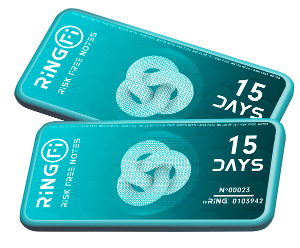

# 🔰 RFN (Risk-Free Notes NFTs)

RingFi RFNs are NFTs that are similar to a vault containing reward assets. These rewards are given to an RFN NFT and will be unlocked when the time period ends.


**RFN Launch** is scheduled for Thursday, April 7, 2022 12:00 AM


To mint an RFN, a user must lock his wRING, and then he’ll receive an NFT. At the same time, the predefined rewards for that particular RFN will be locked and attached to this NFT. There will be multiple lock periods, like 15, 30, 90, and 180 days. The longer the lock period, the higher the rewards.

These NFTs will also be tradable in market places. They will still contain their rewards when they are traded.Additionally, RFNs will increase RING token’s price floor because each RFN NFT that is minted will lock up a certain amount of wRING for a period of time.

When the locked period ends, the NFT will be exchangeable for the initial amount of wRING locked for its purchase plus the rewards (BUSD + wRING).


**Audit Report** by CyberScope\
[https://github.com/coinscope-co/audits/blob/main/wring/riskfreenot.pdf](https://github.com/coinscope-co/audits/blob/main/wring/riskfreenot.pdf)


## **Example**:&#x20;

A user decides to purchase an RFN with a lock period of 90 days and a reward of 87 BUSD plus 8.7 wRING. To purchase it, they must lock 100 wRING in the RingFi Dapp. An NFT will be minted to their wallet. After 90 days, they will be able to burn the NFT and receive all the rewards promised along with the original wRING they locked up.

In the end they will have 108.7 wRING plus 87 BUSD!

Now here’s the best part: The wRING they locked up PLUS the wRING rewards contained inside the RFN were compounding from the rebases THE ENTIRE TIME! When they decide to unwrap their 108.7 wRING, they will receive all their original RING tokens, the RING tokens awarded by the RFN, AND all the rebases that were compounding during that time from both their original RING tokens and the RING tokens awarded by the RFN NFT!

So, in this example, the final RING tokens received would be 108.7 wRING \* Index.

Let’s break that down using today’s index value which is 1.37617. So, that means in this example you started with 100 wRING which equals approximately 137 RING using today’s index value. After the 90 day lock up period, you would have received 108.7 wRING from the rewards in addition to the BUSD rewards.

Now, factoring in 90 days of rebases during that time, that 108.7 wRING would equal 1,154 RING! _So, you would have turned 137 RING into 1,114 RING in 90 days in addition to receiving a bunch of BUSD on top of it!_

That’s the beauty of compounding and mathematics! Brilliant, right?

## **FAQ**

**Are RingFi RFNs standard NFTs as we know them?**

No, the RFNs are not meant to be used as standard NFTs. RFN NFTs are tools that provide extra rewards for the long-term RingFi believers. This is a real use-case for NFTs!

**What’s the benefit of minting RFNs?**

Users who acquire RFNs with their wRING will receive additional rewards like BUSD and extra wRING while still receiving the same exact rebases just like they would from holding RING in their wallets.

Another more subtle benefit is the wRING rewarded by the RFN will also be receiving rebases during the entire lock up period. For example, if 10 RING worth of wRING is to be rewarded after a 30 day lock up period, then the user would receive a reward closer to 20 RING worth of wRING at the end of the lockup period. That’s the beauty of the mathematics behind wRING! It always receives the auto-staking rebases no matter where it is!

**How will RFNs help to improve the protocol?**

RFNs will decrease selling pressure because users will lock their wRING to get RFNs and the rewards they bestow. Also, the RingFi protocol will receive more exposure in the DeFi space because, once again, RingFi has invented another unique innovation that no other DeFi 3.0 auto-staking protocol has yet.

**Why do I need to lock wRING and not RING?**

Unlike rebase tokens, **wRING is ERC-20 compatible**. Rebases complicate the integration of tokens on ERC-20 protocols, wRING (Wrapped RING) solves this problem. wRING is a token that represents the value of RING based on the latest index when you wrap and unwrap respectively. Simplifying, it is a token which amount doesn't increase over time, but so it does its value. When wRING is unwrapped, you receive RING based on the latest (ever-increasing) index, so the total yield is the same.
